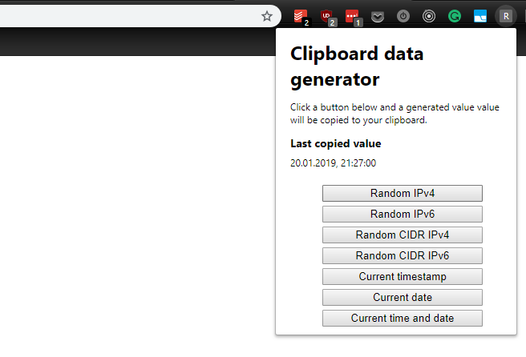

# Chrome clipboard data generator extension



[Install using Chrome Web Store](https://chrome.google.com/webstore/detail/clipboard-data-generator/jeakkdmlghlpbadeigbfebhioefcglef)

A handy extension that fills the clipboard with an automatically generated value, e.g.:

- a random IP (v4 and v6)
- a random CIDR (v4 and v6)
- the current timestamp
- the current date
- the current time and date

## Development

There is no build step for the app. This directory can be selected as the extension's root.

To improve the editing experience and add some typings for the Chrome Extension API, run the
following command:

```sh
npm install
```

## Deployment

Run

```sh
npm run build
```

This command will pack all the necessary extension files in
`chrome-clipboard-data-generator-extension.zip`.

Upload this file to Google Web Store to update the extension.

## Author

[Grzegorz Rozdzialik](http://github.com/Gelio) is the author of this extension.
